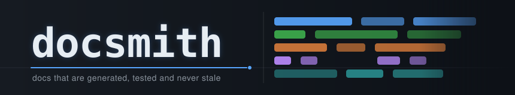
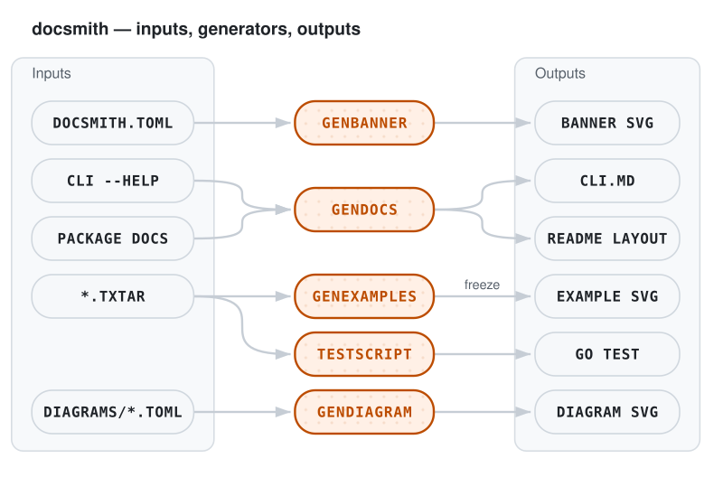
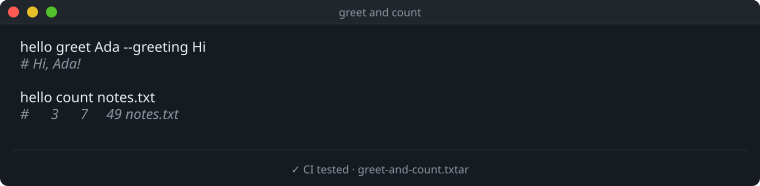

<div align="center">
  <picture>
    <source media="(prefers-color-scheme: dark)"  srcset="docs/assets/banner-dark.svg">
    <source media="(prefers-color-scheme: light)" srcset="docs/assets/banner-light.svg">
    
  </picture>

  <p><b>README banners, diagrams, CLI reference and tested examples for Go command-line tools.</b></p>

  [](https://github.com/viniciusdc/docsmith/actions/workflows/ci.yml)
  [](https://github.com/viniciusdc/docsmith/actions/workflows/drift.yml)
  [](go.mod)
  [](LICENSE)
  [](https://github.com/viniciusdc/docsmith/generate)

</div>

docsmith is a GitHub template for Go CLIs whose documentation should build
itself. Four small generators under `internal/tools/` turn what is already in
the repository into the parts of a README that usually go stale: a themed
banner, architecture diagrams, a command reference read from the real
`--help` output, and terminal screenshots of examples that CI runs on every
push. One file, `docsmith.toml`, drives all of them, so there is no
project-specific code to edit.

## How it works

<div align="center">
<picture>
  <source media="(prefers-color-scheme: dark)" srcset="docs/assets/diagrams/how-it-works-dark.svg">
  
</picture>
</div>

| Generator | Reads | Writes |
|---|---|---|
| `genbanner` | `[banner]` in `docsmith.toml` | `banner-dark.svg`, `banner-light.svg` |
| `gendocs` | `<binary> --help`, recursively; Go package doc comments | the CLI reference and the project tree, between `gendocs:cli` and `gendocs:layout` markers |
| `genexamples` | `testdata/examples/*.txtar` | terminal SVGs rendered with [freeze](https://github.com/charmbracelet/freeze), between `gendocs:example:ID` markers |
| `gendiagram` | `docs/diagrams/*.toml` | `NAME-dark.svg`, `NAME-light.svg` |

Every SVG comes in a dark and a light variant, and the README picks one with
`<picture>` and `prefers-color-scheme`, so it matches the reader's GitHub
theme.

The examples are the part that keeps the docs honest. Each `.txtar` file is
a [testscript](https://pkg.go.dev/github.com/rogpeppe/go-internal/testscript)
that runs the real binary and asserts on its output, plus a `display.sh`
section that shows the same commands in the docs. `go test` runs the script;
`genexamples` renders the display. This one runs in CI with the rest of the
tests:

<!-- gendocs:example:greet-and-count -->
<div align="center">
<a href="testdata/examples/greet-and-count.txtar"><picture>
  <source media="(prefers-color-scheme: dark)"  srcset="docs/assets/examples/greet-and-count-dark.svg">
  <source media="(prefers-color-scheme: light)" srcset="docs/assets/examples/greet-and-count-light.svg">
  
</picture></a>
</div>
<!-- /gendocs:example:greet-and-count -->

## Using this template

1. Click **Use this template** on GitHub, or run
   `gh repo create my-cli --template viniciusdc/docsmith --clone`.
2. Rename the module in `go.mod` and its imports:
   `go mod edit -module github.com/you/my-cli`, then replace
   `github.com/viniciusdc/docsmith` in `cmd/`.
3. Replace `cmd/hello` and `internal/textstat` with your CLI. Any
   [cobra](https://github.com/spf13/cobra) binary works.
4. Edit `docsmith.toml`: project name, tagline, `binary`, `main`, the banner
   text, colours and motif, and the layout annotations.
5. Replace `testdata/examples/*.txtar` with examples of your commands, and
   `docs/diagrams/how-it-works.toml` with your own diagram.
6. Install the tools and regenerate everything:

   ```bash
   make tools      # freeze and golangci-lint
   make generate   # banner, diagrams, CLI reference, layout, examples
   ```

7. Commit the generated files, SVGs included.

## Adopting in an existing repo

The generators do not depend on anything else in this repository, so they
can be dropped into an existing Go module:

1. Copy `internal/tools/genbanner`, `gendiagram`, `gendocs` and
   `genexamples`, plus `docsmith.toml` at the root of the module.
2. Add the dependencies they import:

   ```bash
   go get github.com/BurntSushi/toml github.com/rogpeppe/go-internal/testscript
   ```

3. Set `[project].binary` and `[project].main` in `docsmith.toml`, and point
   `[docs].cli_file` and `[docs].layout_file` at the Markdown files that
   should receive the generated sections. Leave either empty to skip it.
4. Add the markers where generated content belongs. Each marker sits on a
   line of its own; markers inside code blocks, like these, are ignored:

   ```markdown
   <!-- gendocs:cli -->
   <!-- /gendocs:cli -->

   <!-- gendocs:layout -->
   <!-- /gendocs:layout -->

   <!-- gendocs:example:my-example -->
   <!-- /gendocs:example:my-example -->
   ```

5. Copy `cmd/hello/script_test.go` next to your `main` package (adjust the
   binary name and the relative path to the examples directory) so the
   `.txtar` examples run under `go test`.
6. Merge the `docs`, `banner`, `diagrams`, `examples`, `examples-check` and
   `generate` targets from the `Makefile`, and copy
   `.github/workflows/drift.yml`.

Required tools: Go, and for rendered examples
`go install github.com/charmbracelet/freeze@latest`. Without freeze,
`genexamples` writes a fenced code block instead of an image.

## Writing examples

An example is a `.txtar` file whose comment area holds `# doc:` headers and
a testscript, followed by the files the script needs and a `display.sh`:

```text
# doc:id     greet-and-count      marker name and SVG file name
# doc:file   README.md            the file that holds the markers
# doc:tested true                 adds "✓ CI tested" to the footer

exec hello greet Ada --greeting Hi
stdout '^Hi, Ada!$'

-- display.sh --
hello greet Ada --greeting Hi
# Hi, Ada!
```

By convention `display.sh` shows output as comments, which freeze renders in
a muted colour. Rendered SVGs are committed and carry a hash of the snippet
they show; `genexamples` re-renders them when the snippet changes, and
`genexamples -force` re-renders all of them.

## Diagrams

A diagram is a TOML file of nodes, edges and optional groups. Nodes are
styled `source`, `stage`, `sink` or `planned`; edges can carry a label and be
`dashed`. Without `width`/`height` the layout is computed from the edges;
with them, every node gives its own `x`/`y`, which is how
[`how-it-works.toml`](docs/diagrams/how-it-works.toml) lines each generator
up with its output.

## Keeping it in sync

`.github/workflows/drift.yml` regenerates the banner, diagrams, CLI reference,
layout and examples on every push and pull request, and fails when the
result differs from what is committed. freeze output can differ between
machines and freeze versions, so CI does not install it. The rendered example
SVGs are checked through the Markdown that embeds them: when an SVG is stale,
CI falls back to a code block, the Markdown changes and the check fails. Fix
it locally with `make generate`.

## Configuration

Everything lives in [`docsmith.toml`](docsmith.toml); every key has a default.

| Table | Keys |
|---|---|
| `[project]` | `name`, `tagline`, `binary`, `main` |
| `[banner]` | `title`, `subtitle`, `output_dir`, `motif` (`blocks` or `lanes`), `[banner.dark]`/`[banner.light]` with `accent` and `palette`, optional `[[banner.rows]]` or `lanes` + `[[banner.shifts]]` |
| `[diagrams]` | `source_dir`, `output_dir` |
| `[examples]` | `dir`, `svg_dir`, `width` |
| `[docs]` | `cli_file`, `layout_file`, `[docs.layout]` with `root_files`, `skip`, `max_depth` and `[docs.layout.annotations]` |

## Make targets

```bash
make help            # list targets
make test            # unit tests and example scripts
make lint            # golangci-lint
make generate        # banner, diagrams, docs and examples
make examples-check  # what the drift workflow runs for examples
```

## CLI reference

The sample CLI's reference is generated into [docs/CLI.md](docs/CLI.md).

## Project layout

<!-- gendocs:layout -->
```
Makefile          Docs, test and lint targets
cmd/              Executable entry points
  hello/          hello is the sample CLI that ships with the docsmith template
docs/             Generated reference docs and their assets
  diagrams/       Diagram sources (TOML) for gendiagram
docsmith.toml     Configuration for every generator
go.mod            Module definition
internal/         Packages private to this module
  textstat/       textstat counts the lines, words and bytes in a stream of text
  tools/          Documentation generators, run through make
    genbanner/    Generates the README banner SVGs from docsmith.toml
    gendiagram/   Generates architecture diagram SVGs from TOML definitions
    gendocs/      Generates the CLI reference and project layout sections of the docs
    genexamples/  Generates executable documentation snippets
```
<!-- /gendocs:layout -->

## License

docsmith is licensed under the [Apache License 2.0](LICENSE). See
[NOTICE](NOTICE) for the fonts embedded in rendered examples.
